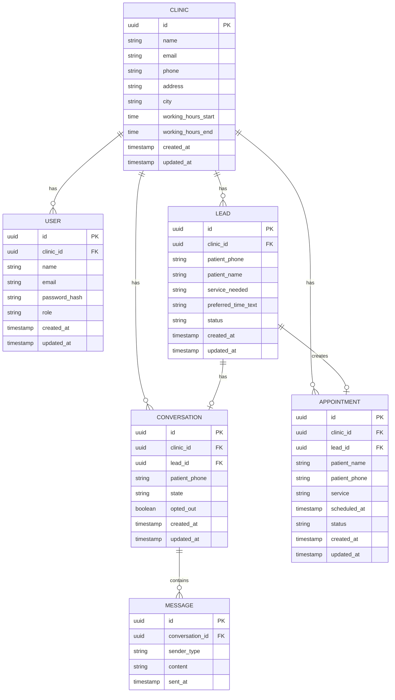

# Database Design

## Important Constraints

- `USER.email` must be unique.
- `CLINIC.phone` must be unique.
- `(clinic_id, patient_phone)` is not unique because the same patient can create multiple leads over time.
- `APPOINTMENT.lead_id` must be unique, ensuring one lead creates at most one appointment.
- `CONVERSATION.lead_id` must be unique in the MVP, ensuring one active conversation per lead.
- Every clinic-owned query must filter by `clinic_id`.